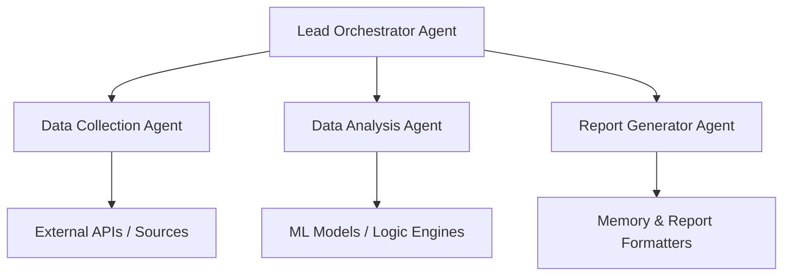

# Multi-Agent Research Orchestrator

An advanced modular system for autonomous research coordination, enabling structured data exploration, analytical processing,
and report generation through intelligent agent collaboration.

## Background & Motivation

In a world flooded with data, researchers and analysts struggle to process complex information at scale. 
Traditional workflows rely on linear and manual processes. This orchestrator leverages a **multi-agent architecture**
to transform abstract queries into concrete, cited knowledge outputs. Inspired by cognitive task decomposition and AI modularity,
this system shows how research can be automated, contextualized, and scaled with precision.

## System Architecture



- **Orchestrator Agent**: Parses queries, delegates tasks.
- **Data Collection Agent**: Interfaces with APIs (e.g., arXiv, PubMed, news feeds).
- **Analysis Agent**: Applies logic, statistics, embeddings, or ML tools.
- **Report Agent**: Assembles findings into structured, human-readable formats.


## Features

- Modular agent registry (easy to extend)
- Long-term memory for continuity across sessions
- PDF/Markdown/JSON output support
- Pluggable interfaces for custom tools
- Supports parallel task execution


## Use Cases

- Scientific literature reviews
- Competitive intelligence
- Policy impact forecasting
- Climate or trend analysis
- Research assistant for startups or academic labs


## Example Output

**Prompt:** _"How do AI tools affect qualitative research in social sciences (2020–2025)?"

**Result:**
- Summary of 20 peer-reviewed sources
- Timeline of AI adoption in major universities
- Ethical implications from 3 academic reports
- Graphs showing usage patterns across Europe
- Full reference list in APA format

##  Installation

```bash
git clone https://github.com/yourusername/multi-agent-research-orchestrator.git
cd multi-agent-research-orchestrator
pip install -r requirements.txt
```

Create `.env` for any API keys:
```
OPENAI_API_KEY=...
ARXIV_API_KEY=...
```

## Usage

```bash
python src/main.py --query "Impact of microplastics on oceanic biodiversity 2024–2030"
```

Output will be saved to `output/reports/` folder.

## Extending the System

To add a new agent:
- Implement a subclass of `BaseAgent`
- Register it in `agent_registry.json`
- Add routing logic in `orchestrator.py`

Planned features:
- [ ] Vector memory
- [ ] Source credibility scoring
- [ ] Plugin architecture for domain tools

## Roadmap

- ✅ MVP orchestration with prompt memory
- ✅ Markdown and PDF generation
- ⬜ Academic formatting engine
- ⬜ Scoring and feedback loop
- ⬜ Jupyter interactive agent interface

## Cite this Work

If you use this system in research, please cite:
```bibtex
@misc{yatskuliak2025research,
  title={Multi-Agent Research Orchestrator},
  author={Orest Yatskuliak},
  year={2025},
  url={https://github.com/...}
}
```

## License

MIT License. Feel free to fork, contribute, and collaborate.

## Contributing

We welcome PRs, suggestions, and bug reports. Please see `CONTRIBUTING.md` for guidelines.

## Contact

For questions, collaborations, or enterprise use:
orest.researcher@gmail.com
